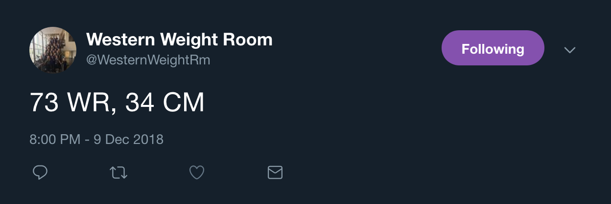

# GyMBRo
Code for a Weight Room Prediction Bot

## Introduction

This repo contains code to run my **GyMRBo** (Gym Monitoring, But Robotically).  The functions here are capable of scraping gym data, updating an existing gym database, training/validating a machine learning algorithm,
scoring the model's performance, and finally tweeting predictions from a dedicated twitter account.


## Where Do I Get The Data?

@WesternWeightRm will periodically tweet out how many people are in the weight room (WR).  Shown below is a typical example



Since the tweets are very consistent in their style, I just use a heuristic to extract the number of people in the weight room.

I also scrape some weather data for the city in which the gym is located (London, Ontario, Canada).

## Where Is The Data Stored?

The data lives in `database/Western_Tweet_Data.sqlite3`.  I wouldn't recommend directly querying the database because there are easier ways to get the data.

## How Do I Access Training Data?

I have written some functions to help with updating the database, querying the database, engineering features, and training a model.  

Updating the database is simple. Shown below is an example of how to update the weather and tweet data, and then extract that data into a single dataframe.

```python
from tools import *

update_tweet_db()
update_weather_db()
X,y = fetch_training()
```
The `fetch_training()` function returns a pandas dataframe of covaraites,  `X`, and an array of weight room numbers, `y`.  

The data is pushed through a machine learning pipeline where I perfrom various feature engineering automatically.  You can get a dataframe of engineered features (for model exploration or other analysis) using `engineer_features(X)`.

A typical workflow, from updates to predictions, looks like

```python
from tools import *
#Update the data
update_tweet_db()
update_weather_db()

#Get training data
X,y = fetch_training()


#Load the trained model
model = load_model()

#Make predictions for today
today = fetch_weather()
today['pred'] = model.predict(today)

#Make a plot of predictions for the day
wr = fetch_wr() #Gets all data from today to plot as comparison
make_plot(today,wr)
```

## Machine Learning Details

I use a `LightGBMRegressor` with a walk forward cross validation (E.g. train on data up to 2014, test on rest.  Train on data up to 2015, test on rest.  So on and so forth. ).

## See More

You can see a more detailed run through of the project in the `Vignette` jupyter notebook.


## This Repo Is In Dire Need Of Documentation

Yea, yea, I know.  I am working on it...slowly.
